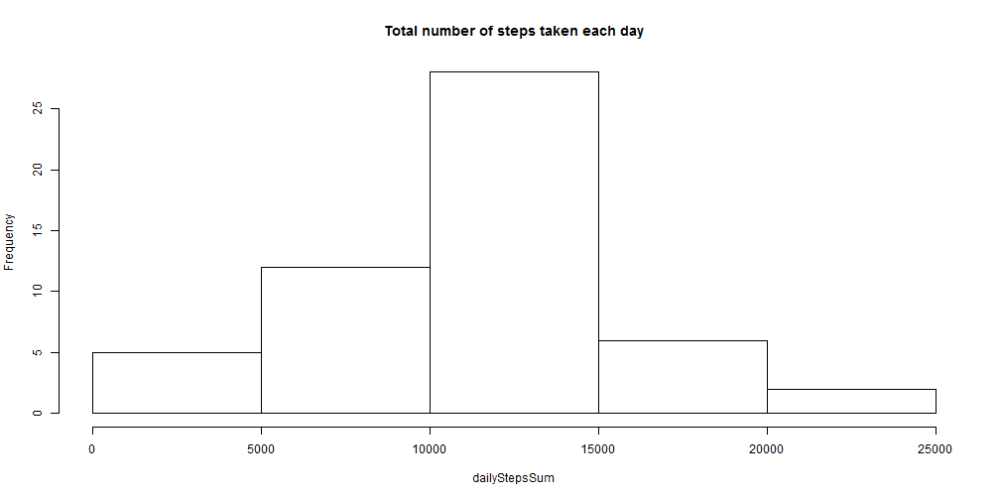
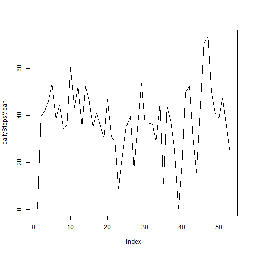
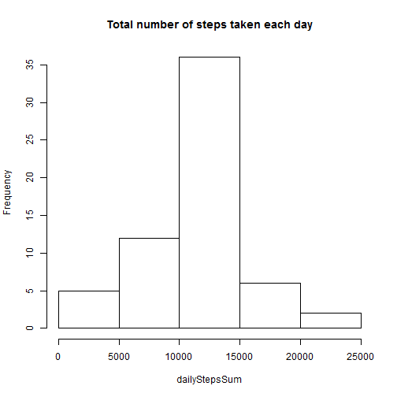

Reproducible Research: Peer Assessment 1
================================================

Created by Luis Gama 
01-15-2017

1 - Code for reading in the dataset and/or processing the data

```r
fileURL <- "https://d396qusza40orc.cloudfront.net/repdata%2Fdata%2Factivity.zip"
download.file(fileURL, "./data/ActivityMonData.zip")

unzip("./data/ActivityMonData.zip", exdir = "./data")

originalDeviceData <- read.csv("./data/activity.csv",
                       header = TRUE,
                       sep = ",",
                       na.strings = "NA",
                       colClasses = c("numeric", "Date", "numeric"))
```

2 - Histogram of the total number of steps taken each day

```r
#Ignoring NAs
deviceData <- na.omit(originalDeviceData)

#Obtaining the number of steps per day
dailyStepsSum <- sapply(split(deviceData$steps, deviceData$date), sum)

hist(dailyStepsSum, main = "Total number of steps taken each day")
```



3 - Mean and median number of steps taken each day

```r
#Obtaining the mean 
dailyStepsMean <- sapply(split(deviceData$steps, deviceData$date), mean)
print(dailyStepsMean)
```

```
## 2012-10-02 2012-10-03 2012-10-04 2012-10-05 2012-10-06 2012-10-07 
##  0.4375000 39.4166667 42.0694444 46.1597222 53.5416667 38.2465278 
## 2012-10-09 2012-10-10 2012-10-11 2012-10-12 2012-10-13 2012-10-14 
## 44.4826389 34.3750000 35.7777778 60.3541667 43.1458333 52.4236111 
## 2012-10-15 2012-10-16 2012-10-17 2012-10-18 2012-10-19 2012-10-20 
## 35.2048611 52.3750000 46.7083333 34.9166667 41.0729167 36.0937500 
## 2012-10-21 2012-10-22 2012-10-23 2012-10-24 2012-10-25 2012-10-26 
## 30.6284722 46.7361111 30.9652778 29.0104167  8.6527778 23.5347222 
## 2012-10-27 2012-10-28 2012-10-29 2012-10-30 2012-10-31 2012-11-02 
## 35.1354167 39.7847222 17.4236111 34.0937500 53.5208333 36.8055556 
## 2012-11-03 2012-11-05 2012-11-06 2012-11-07 2012-11-08 2012-11-11 
## 36.7048611 36.2465278 28.9375000 44.7326389 11.1770833 43.7777778 
## 2012-11-12 2012-11-13 2012-11-15 2012-11-16 2012-11-17 2012-11-18 
## 37.3784722 25.4722222  0.1423611 18.8923611 49.7881944 52.4652778 
## 2012-11-19 2012-11-20 2012-11-21 2012-11-22 2012-11-23 2012-11-24 
## 30.6979167 15.5277778 44.3993056 70.9270833 73.5902778 50.2708333 
## 2012-11-25 2012-11-26 2012-11-27 2012-11-28 2012-11-29 
## 41.0902778 38.7569444 47.3819444 35.3576389 24.4687500
```

```r
#Obtaining the median
dailyStepsMedian <- sapply(split(deviceData$steps, deviceData$date), median)
print(dailyStepsMedian)
```

```
## 2012-10-02 2012-10-03 2012-10-04 2012-10-05 2012-10-06 2012-10-07 
##          0          0          0          0          0          0 
## 2012-10-09 2012-10-10 2012-10-11 2012-10-12 2012-10-13 2012-10-14 
##          0          0          0          0          0          0 
## 2012-10-15 2012-10-16 2012-10-17 2012-10-18 2012-10-19 2012-10-20 
##          0          0          0          0          0          0 
## 2012-10-21 2012-10-22 2012-10-23 2012-10-24 2012-10-25 2012-10-26 
##          0          0          0          0          0          0 
## 2012-10-27 2012-10-28 2012-10-29 2012-10-30 2012-10-31 2012-11-02 
##          0          0          0          0          0          0 
## 2012-11-03 2012-11-05 2012-11-06 2012-11-07 2012-11-08 2012-11-11 
##          0          0          0          0          0          0 
## 2012-11-12 2012-11-13 2012-11-15 2012-11-16 2012-11-17 2012-11-18 
##          0          0          0          0          0          0 
## 2012-11-19 2012-11-20 2012-11-21 2012-11-22 2012-11-23 2012-11-24 
##          0          0          0          0          0          0 
## 2012-11-25 2012-11-26 2012-11-27 2012-11-28 2012-11-29 
##          0          0          0          0          0
```

4 - Time series plot of the average number of steps taken

```r
plot(dailyStepsMean, type = "l")
```



5 - The 5-minute interval that, on average, contains the maximum number of steps

```r
require(dplyr)
deviceDataSorted <- arrange(deviceData, desc(steps))
maxInterval <- deviceDataSorted[1,]
print(maxInterval)
```

```
##   steps       date interval
## 1   806 2012-11-27      615
```

6 - Code to describe and show a strategy for imputing missing data

```r
#6.1 - Calculate and report the total number of missing values in the dataset (i.e. the total number of rows with NAs)
deviceDataNAs <- is.na(originalDeviceData)
sum(deviceDataNAs)
```

```
## [1] 2304
```

```r
#Devise a strategy for filling in all of the missing values in the dataset. The strategy does not need to be sophisticated. For example, you could use the mean/median for that day, or the mean for that 5-minute interval, etc.

#Create a new dataset that is equal to the original dataset but with the missing data filled in.

newDeviceData <- originalDeviceData

agg <- aggregate(steps ~ interval, newDeviceData, mean)

newDeviceData[is.na(newDeviceData)] <- agg$steps
```

7 - Histogram of the total number of steps taken each day after missing values are imputed


```r
#Make a histogram of the total number of steps taken each day and Calculate and report the mean and median total number of steps taken per day. Do these values differ from the estimates from the first part of the assignment? What is the impact of imputing missing data on the estimates of the total daily number of steps?

#Obtaining the number of steps per day
dailyStepsSum <- sapply(split(newDeviceData$steps, newDeviceData$date), sum)

hist(dailyStepsSum, main = "Total number of steps taken each day")
```



```r
#Obtaining the mean 
dailyStepsMean <- sapply(split(newDeviceData$steps, newDeviceData$date), mean)
print(dailyStepsMean)
```

```
## 2012-10-01 2012-10-02 2012-10-03 2012-10-04 2012-10-05 2012-10-06 
## 37.3825996  0.4375000 39.4166667 42.0694444 46.1597222 53.5416667 
## 2012-10-07 2012-10-08 2012-10-09 2012-10-10 2012-10-11 2012-10-12 
## 38.2465278 37.3825996 44.4826389 34.3750000 35.7777778 60.3541667 
## 2012-10-13 2012-10-14 2012-10-15 2012-10-16 2012-10-17 2012-10-18 
## 43.1458333 52.4236111 35.2048611 52.3750000 46.7083333 34.9166667 
## 2012-10-19 2012-10-20 2012-10-21 2012-10-22 2012-10-23 2012-10-24 
## 41.0729167 36.0937500 30.6284722 46.7361111 30.9652778 29.0104167 
## 2012-10-25 2012-10-26 2012-10-27 2012-10-28 2012-10-29 2012-10-30 
##  8.6527778 23.5347222 35.1354167 39.7847222 17.4236111 34.0937500 
## 2012-10-31 2012-11-01 2012-11-02 2012-11-03 2012-11-04 2012-11-05 
## 53.5208333 37.3825996 36.8055556 36.7048611 37.3825996 36.2465278 
## 2012-11-06 2012-11-07 2012-11-08 2012-11-09 2012-11-10 2012-11-11 
## 28.9375000 44.7326389 11.1770833 37.3825996 37.3825996 43.7777778 
## 2012-11-12 2012-11-13 2012-11-14 2012-11-15 2012-11-16 2012-11-17 
## 37.3784722 25.4722222 37.3825996  0.1423611 18.8923611 49.7881944 
## 2012-11-18 2012-11-19 2012-11-20 2012-11-21 2012-11-22 2012-11-23 
## 52.4652778 30.6979167 15.5277778 44.3993056 70.9270833 73.5902778 
## 2012-11-24 2012-11-25 2012-11-26 2012-11-27 2012-11-28 2012-11-29 
## 50.2708333 41.0902778 38.7569444 47.3819444 35.3576389 24.4687500 
## 2012-11-30 
## 37.3825996
```

```r
#Obtaining the median
dailyStepsMedian <- sapply(split(newDeviceData$steps, newDeviceData$date), median)
print(dailyStepsMedian)
```

```
## 2012-10-01 2012-10-02 2012-10-03 2012-10-04 2012-10-05 2012-10-06 
##   34.11321    0.00000    0.00000    0.00000    0.00000    0.00000 
## 2012-10-07 2012-10-08 2012-10-09 2012-10-10 2012-10-11 2012-10-12 
##    0.00000   34.11321    0.00000    0.00000    0.00000    0.00000 
## 2012-10-13 2012-10-14 2012-10-15 2012-10-16 2012-10-17 2012-10-18 
##    0.00000    0.00000    0.00000    0.00000    0.00000    0.00000 
## 2012-10-19 2012-10-20 2012-10-21 2012-10-22 2012-10-23 2012-10-24 
##    0.00000    0.00000    0.00000    0.00000    0.00000    0.00000 
## 2012-10-25 2012-10-26 2012-10-27 2012-10-28 2012-10-29 2012-10-30 
##    0.00000    0.00000    0.00000    0.00000    0.00000    0.00000 
## 2012-10-31 2012-11-01 2012-11-02 2012-11-03 2012-11-04 2012-11-05 
##    0.00000   34.11321    0.00000    0.00000   34.11321    0.00000 
## 2012-11-06 2012-11-07 2012-11-08 2012-11-09 2012-11-10 2012-11-11 
##    0.00000    0.00000    0.00000   34.11321   34.11321    0.00000 
## 2012-11-12 2012-11-13 2012-11-14 2012-11-15 2012-11-16 2012-11-17 
##    0.00000    0.00000   34.11321    0.00000    0.00000    0.00000 
## 2012-11-18 2012-11-19 2012-11-20 2012-11-21 2012-11-22 2012-11-23 
##    0.00000    0.00000    0.00000    0.00000    0.00000    0.00000 
## 2012-11-24 2012-11-25 2012-11-26 2012-11-27 2012-11-28 2012-11-29 
##    0.00000    0.00000    0.00000    0.00000    0.00000    0.00000 
## 2012-11-30 
##   34.11321
```

8 - Panel plot comparing the average number of steps taken per 5 minute interval across weekdays and weekends

```r
#Changing locale to English, so weekdays are shown as the assignment requires
Sys.setlocale("LC_TIME", "English")
```

```
## [1] "English_United States.1252"
```

```r
newDeviceData$day <- ifelse(weekdays(newDeviceData$date) %in% c("Saturday", "Sunday"), "weekend", "weekday")

interval <- aggregate(steps ~ interval + day, newDeviceData, mean)

require(lattice)

xyplot(
        steps ~ interval | day,
        interval,
        type = "l",
        layout = c(1,2),
        xlab = "Interval",
        ylab = "Number of steps"
)
```


